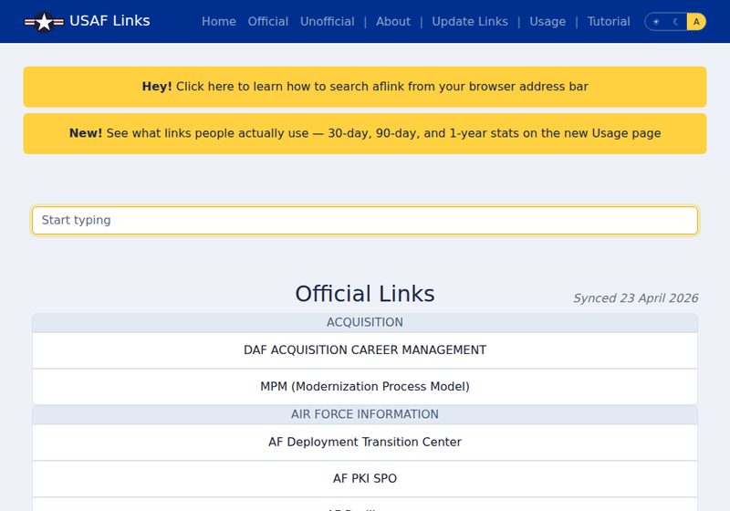

# [aflink.us](https://aflink.us)

An accessible & simple page to find USAF links without needing to mess with the portal. 

Built using PUG templating, Github actions, and node. 

> _Saved XXXk Airmen over XXk hours by eliminating USAF portal logins! Promote now!_

# Link Requests

You may submit different link requests, all of which require a free Github account:

1. Add an `OTHER` link: 
    - [fill out this Github issue form](https://github.com/dadatuputi/aflink/issues/new?template=01_link_add.yaml)
    - When approved, this will add a link to the `OTHER` category
2. Override an existing AF Link
    - Click the `📝` icon when hovering over an existing link in categories other than `OTHER`
    - This will open a new issue with the details needed to match to the link
    - Provide the new Title or URL for the link
    - If you provide neither Title nor URL, this will act as a "deletion", making the link not appear in the list. This is useful for dead links etc.
    - When approved, the link will be overridden or deleted
3. Delete an existing custom link
    - Click the `🗑️` icon when hovering over a link in the `OTHER` category 
    - This will open a new issue with the details needed to match to the link
    - When approved, the link will be deleted